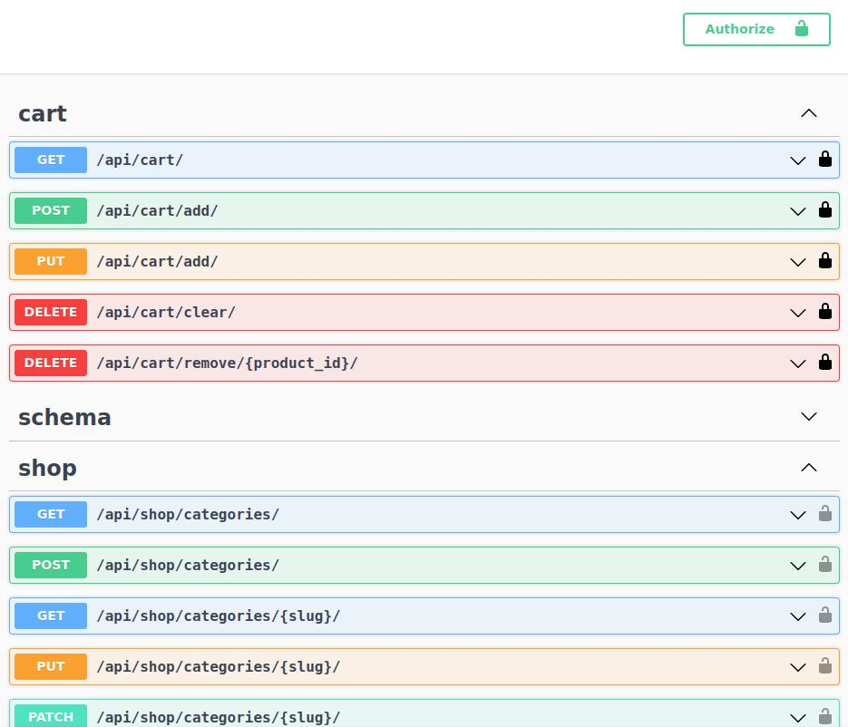

# ecommerce-api
  Simple ecommerce REST API built with Django REST Framework.
  
  

## tba
* cart module tests
* discount coupon system
* order management system
* payment system
* notification system

## Features
* managing categories and products by staff users
* user token authentication
* swagger documentation
* shopping cart session system

## Requirements
* docker and docker-compose

## Installation
Firstly, clone the repository from the github to your local folder with the following command:
```
git clone https://github.com/pietrykovsky/ecommerce-api
```

Next, create an `.env` file where the `docker-compose.yml` is and copy the content from the `.env.sample` file. Example:
```
`.env file`
DJANGO_SECRET_KEY='secret key'
DJANGO_SETTINGS_MODULE='api.settings'
CART_SESSION_ID='cart'

DB_NAME=postgres
DB_USER=admin
DB_PASSWORD=pass123
DB_HOST=db
```

In the same directory, where the `docker-compose.yml` is, run the following commands:
```
docker-compose build
```

To create admin user run:
```
docker-compose run --rm api python manage.py createsuperuser
```

Then start the container with the following command:
```
docker-compose up
```

Now you can head over to http://127.0.0.1:8000/api/docs/

To stop the container run:
```
docker-compose down
```